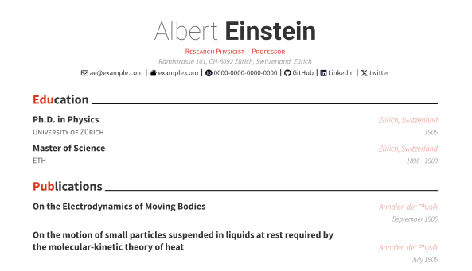

# Quarto-awesomecv-typst Format

A Quarto + Typst implementation of Byungjin Park’s [Awesome-CV](https://github.com/posquit0/Awesome-CV).
The Typst implementation part is inspired by Paul Tsouchlos’s [modern-cv](https://typst.app/universe/package/modern-cv/)



## Install

If you would like to add the clean theme to an existing directory:

```bash
quarto install extension kazuyanagimoto/quarto-awesomecv-typst
```

or you can use a Quarto template that bundles a .qmd starter file:

```bash
quarto use template kazuyanagimoto/quarto-awesomecv-typst
```

## Customization

### YAML

Set author information in YAML.

```yaml
author:
  firstname: Albert
  lastname: Einstein
  address: "Rämistrasse 101, CH-8092 Zürich, Switzerland, Zürich"
  positions: ["Research Physicist",  "Professor"]
  contacts:
    - icon: fa envelope
      text: ae@example.com
      url: "mailto:ae@example.com"
    - icon: PATH_TO_ICON/icon.svg
      text: example.com
      url: https://example.com
```

- [fontawesome](https://fontawesome.com/search?m=free&o=r) icons are supported
via [duskmoon314/typst-fontawesome](https://github.com/duskmoon314/typst-fontawesome) with `fa` prefix.
- SVG icons can be used by specifying the path to the icon file

### Fonts & Color

You can set fonts and the accent color in YAML.

```yaml
style:
   color-accent: "516db0"
   font-header: "Roboto"
   font-text: "Source Sans Pro"
format:
  awesomecv-typst:
    font-paths: ["PATH_TO_FONT"]
```

## kazuyanagimoto/typstcv

This format is designed to be used with an R package [`kazuyanagimoto/typstcv`](http://kazuyanagimoto.com/typstcv/).
It provides a helper function to create a resume entry from a data frame.

```r
library(typstcv)

df_educ |>
  resume_entry(
    title = "title",
    location = "location",
    date = "year",
    description = "detail"
)
```
