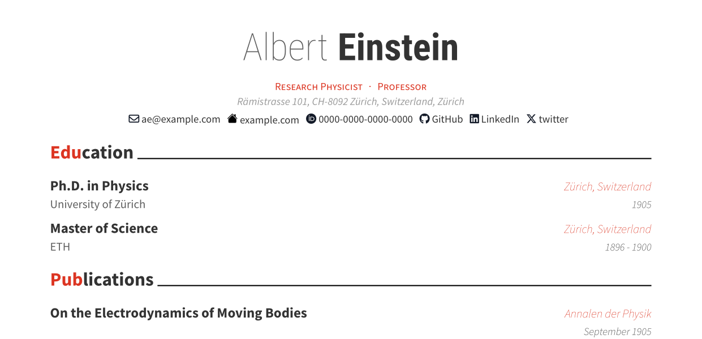

# quarto-awesomecv-typst Format

A Quarto + Typst implementation of Byungjin Park’s
[Awesome-CV](https://github.com/posquit0/Awesome-CV). The Typst
implementation part is inspired by Paul Tsouchlos’s
[modern-cv](https://typst.app/universe/package/modern-cv/)

[](https://kazuyanagimoto.com/quarto-awesomecv-typst/template.pdf)

## Install

If you would like to add the clean theme to an existing directory:

``` bash
quarto install extension kazuyanagimoto/quarto-awesomecv-typst
```

or you can use a Quarto template that bundles a .qmd starter file:

``` bash
quarto use template kazuyanagimoto/quarto-awesomecv-typst
```

## Customization

### YAML

Set author information in YAML.

``` yaml
author:
  firstname: Albert
  lastname: Einstein
  address: "Rämistrasse 101, CH-8092 Zürich, Switzerland, Zürich"
  position: "Research Physicist ・ Professor"
  contacts:
    - icon: fa envelope
      text: ae@example.com
      url: "mailto:ae@example.com"
    - icon: PATH_TO_ICON/icon.svg
      text: example.com
      url: https://example.com
```

- [fontawesome](https://fontawesome.com/search?m=free&o=r) icons are
  supported via
  [duskmoon314/typst-fontawesome](https://github.com/duskmoon314/typst-fontawesome)
  with `fa` prefix.
- SVG icons can be used by specifying the path to the icon file (e.g.,
  Google Scholar icon from
  [Academicons](https://jpswalsh.github.io/academicons/))

### Fonts & Color

You can set fonts and the accent color by
[\_brand.yml](https://quarto.org/docs/authoring/brand.html) notation in
YAML.

``` yaml
brand:
  typography:
    base: Source Sans 3
  color:
    primary: "#516db0"
    link: "#202b47"
  defaults: 
    awesomecv-typst:
      font-header: Roboto
```

### Profile Photo

You can set a profile photo in YAML. If you set it, the header will be
left-aligned.

``` yaml
profile-photo: "PATH_TO_PHOTO/photo.jpg"
```

## YAML Inputs

This templates supports the following YAML inputs:

``` yaml
nobel-prize:
  title: Nobel Prize in Physics
  location: Stockholm, Sweden
  date: 1921
  description: For his services to
  details:
    - Theoritical Physics
    - Discovery of the law of the photoelectric effect
```

An item has `title`, `location`, `date`, `description`, and `details`
fields. You can add a yaml file by the following shortcode:

``` yaml

```

## kazuyanagimoto/typstcv

This format is designed to be used with an R package
[`kazuyanagimoto/typstcv`](http://kazuyanagimoto.com/typstcv/). It
provides helper functions to create a resume entry from a data frame.
Please refer to the package
[documentation](http://kazuyanagimoto.com/typstcv/) for more details.

``` r
library(typstcv)

educ <- data.frame(
  title = c("Ph.D. in Physics", "Master of Science"),
  location = c("Zürich, Switzerland", "Zürich, Switzerland"),
  date = c("1905", "1896 - 1900"),
  description = c("University of Zürich", "ETH")
)

resume_entry(educ)
```

    ```{=typst}
    #resume-entry(title: [Ph.D. in Physics],location: [Zürich, Switzerland],date: [1905],description: [University of Zürich],)
    #resume-entry(title: [Master of Science],location: [Zürich, Switzerland],date: [1896 - 1900],description: [ETH],)
    ```

``` r
award <- data.frame(
  title = c("Nobel Prize in Physics"),
  location = c("Stockholm, Sweden"),
  date = c("1921"),
  description = c("For his services to"),
  detail1 = c("Theoretical Physics"),
  detail2 = c("Discovery of the law of the photoelectric effect")
)

resume_entry(award, details = c("detail1", "detail2"))
```

    ```{=typst}
    #resume-entry(title: [Nobel Prize in Physics],location: [Stockholm, Sweden],date: [1921],description: [For his services to],)
    #resume-item[
    - Theoretical Physics
    - Discovery of the law of the photoelectric effect
    ]
    ```

``` r
work <- data.frame(
  title = c("Technical Assistant", "Junior Professor", "Associate Professor"),
  location = c(
    "Bern, Switzerland",
    "Bern, Switzerland",
    "Zürich, Switzerland"
  ),
  start = as.Date(c("1902-01-01", "1908-01-01", "1909-01-01")),
  end = as.Date(c("1908-01-01", "1909-01-01", "1911-01-01")),
  description = c(
    "Federal Patent Office",
    "University of Bern",
    "University of Zürich"
  )
)

work |>
  format_date(end = "end", date_format = "%Y", sort_by = "start") |>
  resume_entry()
```

    ```{=typst}
    #resume-entry(title: [Associate Professor],location: [Zürich, Switzerland],date: [1909 - 1911],description: [University of Zürich],)
    #resume-entry(title: [Junior Professor],location: [Bern, Switzerland],date: [1908 - 1909],description: [University of Bern],)
    #resume-entry(title: [Technical Assistant],location: [Bern, Switzerland],date: [1902 - 1908],description: [Federal Patent Office],)
    ```
